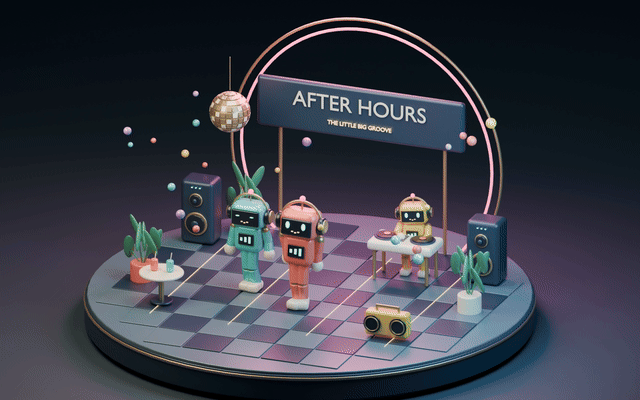
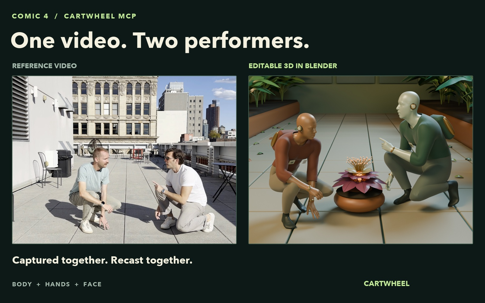
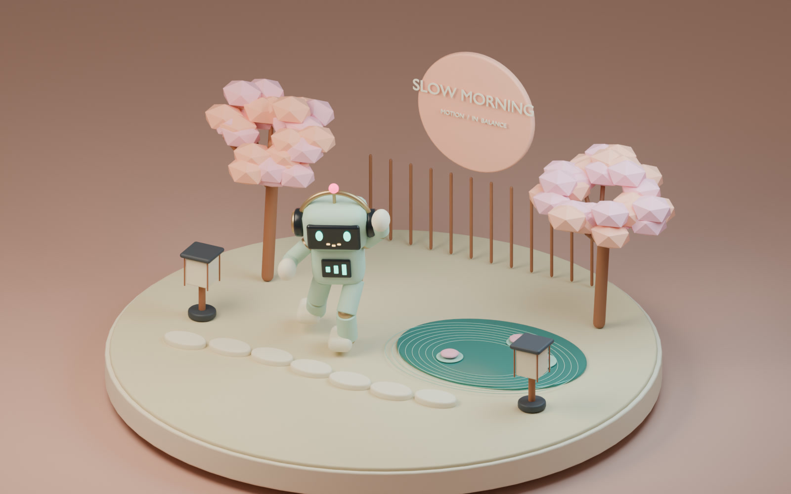
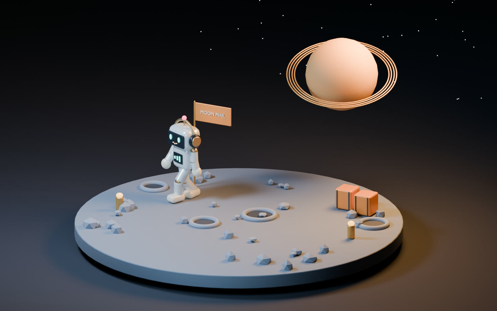

# Cartwheel MCP

**Create and auto-rig characters. Generate, capture and edit their motion.**

Cartwheel MCP connects your AI assistant to [Cartwheel](https://getcartwheel.com)'s public API. Create a character from text or an image, upload and auto-rig your own model, then animate it. Generate body motion from text with **swing-edit**, constrain it with Motion Editor controls, or capture up to four performers from a video with Comic 4, including facial animation. Edit performances with paths and poses, loop or stitch clips, measure motion metadata, and run the bundled Three.js game reference.

[](docs/media/after-hours.mp4)

[Watch the Blender demo](docs/media/after-hours.mp4) · [Production setup walkthrough](docs/SETUP.md) · [MCP Blender workflow](#default-blender-workflow-in-mcp) · [More Blender examples](examples/blender/README.md)

## Three generated characters, one Blender scene

[](docs/media/lantern-port.mp4)

**Lantern Port** takes three text descriptions through character generation and auto-rigging, combines Comic 4 acting with swing-edit walking, then renders a miniature skyport with four camera shots and a frog close-up. The example includes the three rigged assets, exact prompts, reproducible Blender scripts, and the reviewed shoulder, face and Gaussian foot-contact fixes.

[Watch Lantern Port](docs/media/lantern-port.mp4) · [Rebuild the scene](examples/lantern-port/README.md) · [Create and auto-rig characters](src/workflows/characters.md)

## What you need

- **Node.js 22 or newer** and Git.
- **A Cartwheel production account with API access** and a project API key. Check the [current plans](https://getcartwheel.com/pricing); API access is not included in every plan.
- **An MCP client that can launch local stdio servers.** This repository runs on your machine; it is not a hosted MCP URL.
- **Blender only if you want to render the examples.** The MCP server itself does not require Blender.

## 1. Get a Cartwheel API key

1. Open [Cartwheel](https://getcartwheel.com), choose an API-enabled plan, and create your account. Complete email verification and any plan setup shown by the site.
2. Open your Cartwheel dashboard and select **API keys**.
3. Create or reveal a key for your workspace/project. Key management may require a workspace administrator.
4. Copy the **secret key value**. The project ID and API Gateway key ID are not substitutes.

The [setup guide](docs/SETUP.md) includes a recording of the actual production signup interface and the steps that follow.

## 2. Install

```sh
git clone https://github.com/Cartwhl/cartwheel-mcp.git
cd cartwheel-mcp
npm ci
```

There is no compilation step. The source runs directly on Node.js.

## 3. Connect your assistant

For clients with a JSON `mcpServers` configuration, add the following. Replace the absolute path and provide your own key through the client's environment or secret settings:

```json
{
  "mcpServers": {
    "cartwheel": {
      "command": "node",
      "args": ["/absolute/path/to/cartwheel-mcp/src/index.mjs"],
      "env": {
        "CARTWHEEL_API_KEY": "YOUR_CARTWHEEL_PROJECT_API_KEY"
      }
    }
  }
}
```

Use an absolute path: clients may launch the process from a different working directory. Restart or reconnect the client after changing its configuration.

For **Codex**, add this to `~/.codex/config.toml` and make `CARTWHEEL_API_KEY` available in the environment that launches Codex:

```toml
[mcp_servers.cartwheel]
command = "node"
args = ["/absolute/path/to/cartwheel-mcp/src/index.mjs"]
env_vars = ["CARTWHEEL_API_KEY"]
```

See the [Codex MCP configuration documentation](https://learn.chatgpt.com/docs/extend/mcp?surface=cli) for app setup and environment settings.

For a local terminal session, you can instead copy `.env.example` to `.env`, enter your key there, and run `npm start`. The `.env` file is gitignored. A running stdio server waits quietly for MCP input; it does not display a web page.

## 4. Choose a motion workflow

| Option | Use it for | Entry point |
| --- | --- | --- |
| **swing-edit** | Fresh text-to-motion, paths, poses and constrained editing. Used by the MHR game example. | `edit_motion`; read the `swing_edit_motion` prompt or `cartwheel://workflows/swing-edit`. |
| Swing | Standalone text generation in batches. | `generate_motion` with `requestedModel: "swing"`. |
| Comic 4 | Video capture with one to four performers and optional faces. | `generate_motion_from_video`. |

For swing-edit, ask:

> Use the swing-edit workflow. Find an accessible seed motion, create an isolated scene on MHR, and generate a new relaxed walk from text only. Review the completed performance, apply it, then export the scene with root travel intact.

swing-edit uses an existing scene timeline slot as its skeleton and export template. Text-only requests omit both `constraints` and `keyPoses`; the old body performance does not condition generation. Source-dependent hierarchy and unmapped finger channels still need attention. The [swing-edit guide](src/workflows/swing-edit.md) covers character selection, static hand poses and the complete lifecycle. **Use `edit_motion` for swing-edit**; `generate_motion.requestedModel` belongs to the separate standalone generation API.

For a standalone Swing batch, try:

> List my Cartwheel characters. Use one to generate an eight-second joyful disco dance with Swing. Submit it once, check the batch until it finishes, and give me the BVH download link.

The workflow is:

```text
list_characters → generate_motion → get_batch → list_batch_motions → download BVH
```

Generation is asynchronous and consumes Cartwheel credits. Submitting another generation does not check the first one; it starts another job. Poll the returned batch instead.

Example `generate_motion` arguments:

```json
{
  "batchName": "My first MCP animation",
  "prompts": ["A person dancing a playful disco groove in place"],
  "requestedModel": "swing",
  "swingProperties": { "duration": 8 },
  "exportSettings": {
    "characterID": "REPLACE_WITH_AN_ID_FROM_LIST_CHARACTERS",
    "exportType": "bvh",
    "forward": "Z",
    "up": "Y",
    "frameRate": 24,
    "frameStepSize": 1
  }
}
```

For `list_batch_motions`, pass both `batchID` and `limit` (for example, `10`). Responses retain the API's pagination tokens and download URLs. Asset URLs can expire; retrieve the motion again for a fresh link.

## Tools

| Tool | What it does |
| --- | --- |
| `generate_motion` | Submit text prompts with model and export settings. **Consumes credits.** |
| `create_media_upload` | Prepare signed upload slots for videos or character-reference images. The client uploads the bytes. |
| `get_media` | Retrieve reference-media metadata and a fresh download URL. |
| `generate_motion_from_video` | Capture a video with Comic 4, one to four actors, and optional faces. **Consumes credits.** |
| `get_batch` | Check an asynchronous batch's status and progress. |
| `list_batch_motions` | Get a batch's motions, BVH links, and previews. |
| `get_motion` | Retrieve a motion and optional character/export parameters. |
| `list_motions` | Browse recent generations. |
| `search_motions` | Search the motion library by text, category, or tags. |
| `list_characters` | Find accessible character IDs and assets. |
| `get_character` | Poll character generation or auto-rigging and retrieve assets for the exact requested ID. |
| `prepare_character_generation` | Prepare a character from a text prompt or uploaded image. **Consumes credits.** |
| `submit_character_generation` | Start generation using the prepared job ID; returns a character ID for polling. |
| `create_character_upload` | Prepare signed model/config/optional thumbnail upload slots. |
| `submit_character_upload` | Auto-rig an uploaded mesh or detect an existing rig after bytes are uploaded. |
| `list_scenes` | Browse scenes. |
| `get_scene` | Inspect one scene. |
| `create_scene` | Create an editable scene from accessible motion IDs. |
| `loop_motion` | Trim and loop an existing motion; creates a new motion. |
| `stitch_motions` | Trim/blend two motions in order; creates a new motion. |
| `edit_motion` | Generate with **swing-edit** from text, or constrain motion with paths, poses, hand/foot controls and curved repathing. **Consumes credits.** |
| `edit_key_poses` | Regenerate with **swing-edit** around compatible native pose snapshots. **Consumes credits.** |
| `save_key_poses` | Save or clear the complete editor pose list without generation. |
| `set_scene_character` | Retarget an existing scene object to the selected accessible character. |
| `list_motion_edits` | Inspect edit history for a scene timeline slot. |
| `get_motion_edit` | Check a submitted edit and retrieve its completed output. |
| `apply_motion_edit` | Apply a reviewed, completed edit to its verified scene slot, or revert using a completed historical job. |
| `export_scene` | Export the scene on its chosen characters, including applied swing-edit edits. |
| `get_scene_exports` | Check scene exports and retrieve fresh download links. |
| `analyze_motion` | Measure contacts, root travel, strides, flight candidates and loop endpoints; inspect setup-frame handling. |

List pagination uses `nextToken`. Search requires `pageSize` and uses the response's `lastSort` array as `searchAfter`.

## Character creation and auto-rigging

Use **`create_rigged_character`** or **`cartwheel://workflows/characters`**. Ask your assistant:

> Create a friendly forest courier from this reference image, wait for the rigged character, and test a short swing-edit walk in Blender.

Or:

> Upload this GLB, auto-rig it, download the rigged GLB and config, and inspect the shoulders and knees with a short animation.

```text
Text/image: prepare_character_generation → submit_character_generation → get_character
Model:     create_character_upload → upload bytes → submit_character_upload → get_character
```

For a reference image, first use `create_media_upload` and upload the PNG, JPG, JPEG or WebP bytes. Preparation accepts exactly one `prompt` or `mediaID` and consumes credits. A model upload needs no config to start: the API auto-rigs unrigged meshes and detects existing rigs. The client handles file bytes with the [bundled upload helper](examples/characters/README.md).

Wait for `uploadStatus: "COMPLETE"` and actual deliverables. **For uploaded models, use `baseFbxURL` or `baseGlbURL` for the rigged result; `characterFileURL` may still be the original unrigged mesh.** Generation's `3D_CONVERT_COMPLETE` is not rig completion. Failed or validation-required jobs need inspection, not automatic resubmission.

The [complete character workflow](src/workflows/characters.md) covers optional configs, processing states, timeout recovery, downloads and reuse with swing-edit. Review the resulting rig with a short animation before building a full scene. Auto-rigging does not promise facial blendshapes or conversion to MHR.

## swing-edit game animation and Motion Editor

Version **0.7.0** includes the [swing-edit Motion Playground](examples/game/README.md): one MHR character, four swing-edit body performances, idle/walk/run transitions, an interruptible right-arm signal, contact-driven effects and a small crowd. Static hand poses are chosen explicitly. The native MHR pose corrections handle deformation; there is no consumer shoulder-rotation patch.

```sh
npm run example:game
```

Open the printed localhost URL. The bundled game needs no API key. Walk/run cadence follows actual movement distance through reviewed interior cycles. Hip sway is retained; the signal replaces the corresponding right-arm locomotion tracks. Source & metrics shows each swing-edit prompt and the playback measurements. Each clip’s metadata also records its seed, skeleton identity and source/prepared hashes. The [preparation helper](examples/game/README.md#prepare-a-replacement-clip) handles setup frames, trims, event remapping and measured travel.

Two MCP workflows work together:

- **`swing_edit_motion`** / **`cartwheel://workflows/swing-edit`**: generate, constrain, review, apply and export.
- **`game_ready_animation`** / **`cartwheel://workflows/game`**: prepare compatible assets and integrate them into the playable controller.

```text
find an accessible seed motion → create_scene → get_scene
  → set_scene_character → edit_motion / edit_key_poses
  → get_motion_edit → review → apply_motion_edit
  → export_scene → get_scene_exports
  → client prepares BVH + metadata → Three.js game
```

The [swing-edit workflow](src/workflows/swing-edit.md) documents every supported Motion Editor primitive:

| Primitive | Controls |
| --- | --- |
| Fresh text motion | Prompt, duration and optional seed; omit constraints and key poses. |
| Root path and facing | Sparse or dense X/Z waypoints and optional heading pairs. |
| Full-body or native key poses | Timed local rotations and root positions; native snapshots retain the exact scene BVH order and units. |
| Hand, foot and selected effectors | Left/right hand or foot, or a selected set of hands, feet and hips. These require correctly converted swing-edit SOMA-30 or SOMA-77 poses. |
| Curved repathing | Bézier handles, holds, tangent/original heading, source-detail preservation and optional pose/effector stamps. |
| Editor state and delivery | Save/clear poses, inspect history, apply/revert, change character and export the applied scene. |

Read the coordinate contracts before constructing constraints: inline positions are meters, native pose positions retain source units, and rotations are axis-angle radians. End-effector constraints do **not** remap arbitrary MHR or Axel pose arrays. The bundled [SOMA-30 joint order](examples/game/swing-edit-skeleton.json) identifies the expected order; it is not a rig converter. Ordinary inline constraints and native key poses cannot be mixed; the documented built-in repath envelope is the supported exception.

Edits are asynchronous and consume credits. Submit once and poll the existing job. Loop/stitch operations act on **motion IDs**, not editor job IDs or unapplied scene edits; they create new motion IDs and can take up to four minutes. After an uncertain mutation, inspect existing state before resubmitting.

Contacts are kinematic estimates. Authored signal/VFX timing is separate. Selected cycles, transitions, masks and character retargets still need visual review; switching to swing-edit is not a general repair for every motion/character combination. The [audit](examples/game/AUDIT.md) records the changes and limits.

See the [game workflow](src/workflows/game.md), [runnable example](examples/game/README.md) and [asset provenance](examples/game/ASSETS.md). Reconnect the MCP after updating to discover **30 tools and five workflows**.

## Comic 4: video to editable 3D

[](docs/media/comic4-camera-reveal.mp4)

[Watch the 10-second camera reveal](docs/media/comic4-camera-reveal.mp4) · [Clean Blender shot](docs/media/comic4-botanical-bureau.mp4) · [How the demo was made](docs/COMIC4.md)

The demo captures two performers together, preserves their timing and placement, and turns them into botanical androids in a conservatory. A moving Blender camera shows a viewpoint absent from the reference. The scene, costumes and camera work are authored; Comic 4 supplies the body, hand and facial performances.

Ask your assistant:

> Use the Comic 4 Blender workflow to capture both people and their faces from this video. Keep their relative placement, import the complete performance into Blender, and render a camera angle that wasn't in the original video.

The **`comic4_blender_scene`** prompt and **`cartwheel://workflows/comic4`** resource provide the full process:

```text
create_media_upload → client PUTs video bytes → generate_motion_from_video
  → get_batch → list_batch_motions → import every actor into Blender
```

Use an authorized video of at most 30 seconds and less than 250 MB. Select `comicModel: "comic4"`, set `numPeople` explicitly for a group, and enable `facialCapture` when needed. The [runnable upload helper and complete request example](examples/comic4/README.md) explain each step. The helper runs through your client's local execution tools; the MCP server has no filesystem access tool.

Capture returns editable performance data, not a finished scene. Preserve actor indices and shared world placement. Retrieve all body and face outputs from `list_batch_motions`, including the source-camera FBX when available. The API's legacy `faceURLs[i].bvhURL` field points to an **MHR FBX**, not a BVH; a custom character needs a compatible rig or facial retargeting. Use `get_motion` with `characterID` and `bodyIndex` to retarget a particular actor's body. See the [Comic 4 workflow](src/workflows/comic4.md) for import checks and camera-reveal guidance.

After updating, reconnect your MCP server to discover the new tools, prompt, and resource.

## Default Blender workflow in MCP

The server exposes the approved grounding and rendering process directly through MCP:

- **Prompt:** `grounded_blender_scene`, with an optional `scene` description.
- **Resource:** `cartwheel://workflows/blender`.
- **Bundled files:** Blender scripts, validation, and all four generated example motions under `examples/blender/`.

Choose the prompt in a client that supports MCP prompts, or ask your assistant:

> Use Cartwheel's grounded Blender workflow to make a playful robot scene. Start with a motion preview, check foot contact and pose continuity, then render the final movie.

The server instructions direct Blender requests to this workflow. The [complete guide](src/workflows/blender.md) covers generation, preserved root travel, Gaussian contact easing, stable knee IK, continuous foot yaw, validation, and final rendering. The example driver runs the contact and continuity checks before rendering movies. Your MCP client's authorized local tools run Blender and handle files.

After updating this repository, restart or reconnect the MCP server so your client discovers the new prompt and resource.

## Blender gallery

The examples use Cartwheel-generated BVH motion, procedural characters and sets, and Blender Cycles rendering. The scene source and original music are included.

| Example | Style | Motion |
| --- | --- | --- |
| [After Hours](docs/media/after-hours.mp4) | Glossy neon toy diorama | Two generated dances and an animated DJ |
| [Slow Morning](docs/media/slow-morning.mp4) | Pastel paper-and-clay garden | Flowing tai chi |
| [Moon Mail](docs/media/moon-mail.mp4) | Cinematic lunar miniature | Generated walking on a curved Blender trajectory |

[](docs/media/slow-morning.mp4)

[](docs/media/moon-mail.mp4)

See [the Blender guide](examples/blender/README.md) for source files, rendering instructions, and motion provenance.

**Paths and poses:** `generate_motion` is text generation. Use the new `edit_motion` and `edit_key_poses` tools for Motion Editor conditioning. The older Moon Mail demo uses a Blender trajectory and contact solve; it was not generated with these editor tools.

## Security and scope

- Calls go to Cartwheel's **fixed public production API** using your own project key.
- The server exposes 30 explicit tools. It has no generic HTTP proxy, database access, shell tools, account administration, billing, or deletion tools.
- `analyze_motion` reads bounded BVH assets only from approved Cartwheel production storage. API keys are never sent to asset storage. The optional game server is a separate loopback-only process without an API proxy.
- It does not expose callback registration, subscriber management, or impersonation fields.
- Requests are validated, redirects are rejected, and failed requests are never automatically retried.
- Keys stay in the local environment. They are not bundled in the package or examples.
- Tool results are visible to your MCP client and its model provider. Treat returned metadata as data, not instructions.

Read [SECURITY.md](SECURITY.md) for the trust boundary and reporting details.

## Troubleshooting

| Symptom | Action |
| --- | --- |
| `CARTWHEEL_API_KEY is required` | Supply the key in the environment of the process your MCP client launches. |
| HTTP 403 | Check the secret key, production environment, workspace permissions, and API-enabled plan. |
| Invalid arguments | Read the tool's schema. Text generation requires `prompts` and `requestedModel`; video capture requires `mediaIDs` and `comicModel: "comic4"`. Both require complete `exportSettings`. |
| Video capture cannot read the reference | Creating a media slot does not upload the video. Complete the signed PUT before submitting capture. |
| Character is still unrigged after download | Wait for `COMPLETE`; for uploads, use `baseFbxURL`/`baseGlbURL`, not the original `characterFileURL`. |
| Character preparation times out | It may have consumed credits. Do not repeat automatically. Preserve any returned job ID; see the character workflow for recovery. |
| HTTP 429 | Respect `retryAfter` and your plan's batch/concurrency limits. |
| Generation times out | It may have been accepted. Check recent motions before submitting again. |
| Server starts but prints nothing | Expected for stdio. Connect an MCP client to communicate with it. |
| Hosted-only client asks for a URL | This version is local stdio. A GitHub repository URL is not an MCP endpoint. |

## Development

```sh
npm ci
npm test
npm pack --dry-run
```

Tests use the official MCP client, in-memory transports, and a real stdio subprocess. They validate tool and workflow discovery, prompt/resource retrieval, request schemas, authentication, pagination, character generation, model/image upload, auto-rig submission and status handling, motion generation submission, error redaction, route boundaries, and package contents without using real credentials or spending credits.

`src/tools.json`, `src/game-tools.mjs`, `src/swing-edit-constraints.mjs`, `src/scene-tools.mjs` and `src/character-tools.mjs` contain the selected authenticated API contracts. Keep changes aligned with the [public Cartwheel API documentation](https://api-docs.getcartwheel.com). The server is self-contained and does not require any other Cartwheel repository. Three.js supplies BVH loading, transforms and animation utilities; there is no local model runtime.

## Distribution

This GitHub repository is the source distribution and installation entry point. It is not itself a hosted MCP service. The npm manifest is ready for packaging, but this README does not claim an npm release or MCP Registry listing.

The [MCP Registry](https://modelcontextprotocol.io/registry/about) is a separate discovery service that points to installable packages or remote servers. Registry listing and package publication are separate from publishing source on GitHub.

## License

[MIT](LICENSE). Cartwheel service access and generated assets remain subject to your Cartwheel account terms.
