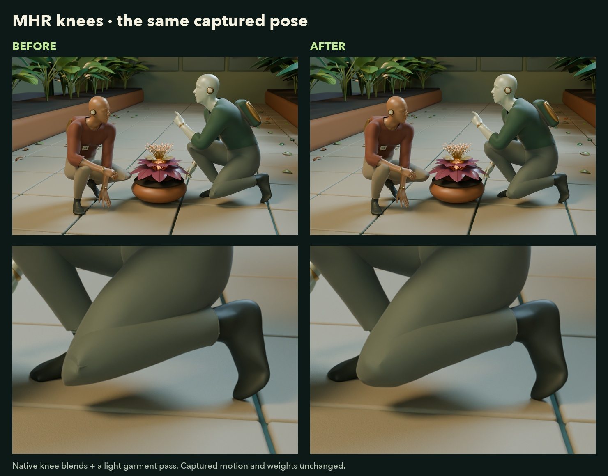

# Comic 4: one video, a new point of view

[Watch the demo](media/comic4-camera-reveal.mp4) · [Watch the clean camera shot](media/comic4-botanical-bureau.mp4) · [Run the workflow](../examples/comic4/README.md)

Two performers crouch together and exchange a quiet gesture in a single rooftop take. Comic 4 captures both people. In Blender, the same performance becomes two botanical androids inspecting a luminous specimen in a conservatory. Their timing and relative placement stay intact as the camera moves to a new angle.

## What the movie shows

| Time | View |
| --- | --- |
| 0–2 seconds | Synchronized reference footage and the finished Blender scene. |
| 2–5 seconds | The performance continues while the Blender camera moves around the pair. |
| 5–7 seconds | A labeled replay of the captured facial animation. |
| 7–9 seconds | A labeled replay showing the actual animated rig joints. |
| 9–10 seconds | Closing card. |

The clean five-second version contains the continuous camera shot without graphics or replays. Both files are 1600 × 1000, 30 fps H.264 MP4s, designed to work without sound. This is an edited demonstration, not a claim about capture or rendering speed.

## Capture and scene work

The source was normalized to 30 fps before upload. The MCP submitted one Comic 4 capture with two people, facial capture enabled, and in-place conversion disabled. Both per-person MHR FBXs retained body, finger and facial animation. The captured camera was also imported for inspection.

The scene uses the captured MHR bodies and their skin weights. Garment shells, fitted trim, eye inserts, metallic surface treatments, the conservatory, plants, specimen and editorial camera were authored in Blender. The eye inserts use captured gaze coefficients; the imported facial shape keys animate the face and eyelids. The rig view draws connections between evaluated joint positions from those same performers.

This capture's MHR FBX sample cadence differed from its source video and camera: 537 body samples covered a 269-frame reference. After checking source poses, the body and facial action times were scaled by 0.5 together; the correctly timed camera was left unchanged. The [importer's explicit timing options](../examples/comic4/README.md#import-the-captured-mhr-performers) handle this verified case. Do not apply that factor to every capture.

The common set floor was fitted to the captured supporting soles. Neither performer was independently recentered, rescaled or given a replacement root path. No added foot IK drives this example.

The MHR FBXs retained facial animation but omitted MHR's separate body pose-corrective data. The knee pass restores the official corrective blends through native Blender drivers, with a soft boundary into the thigh and calf. Matching deltas keep the trousers aligned with the body; a light garment-only smoothing pass softens the cloth fold. The captured weights and motion remain intact. [Knee setup and verification](../examples/comic4/README.md#mhr-knees-in-deep-crouches) are included in the workflow.

## Reproduce the process

Use your own authorized clip and accessible character assets. Ask an MCP client for the `comic4_blender_scene` prompt, or read `cartwheel://workflows/comic4`.

The [runnable example](../examples/comic4/README.md) covers signed upload, the exact capture request, asynchronous polling, every actor's exports, and the Blender importer. The [workflow guide](../src/workflows/comic4.md) covers synchronization, faces, shared coordinates and camera review. Source footage, captured model files and private API responses for this demonstration are not bundled with the MCP package.

## Credits

- Character foundation: [MHR](https://github.com/facebookresearch/MHR), retrieved from Cartwheel's accessible character library. The upstream project is published under [Apache 2.0](https://github.com/facebookresearch/MHR/blob/main/LICENSE); third-party assets retain their own license terms.
- Environment lighting: [Glasshouse Interior](https://polyhaven.com/a/glasshouse_interior), Dario Barresi / Poly Haven, CC0.
- Reference performance: Cartwheel demonstration footage.
- Character finishing, scene, cinematography and edit: authored for this demonstration in Blender and local media tools.
