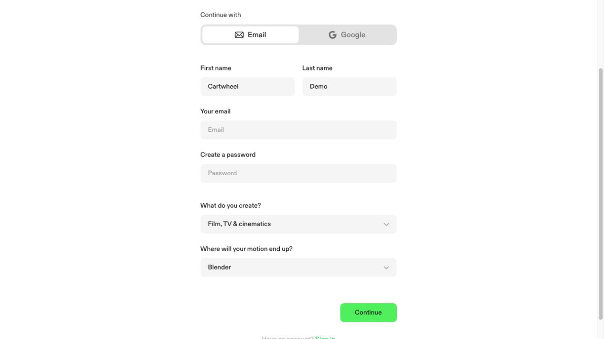
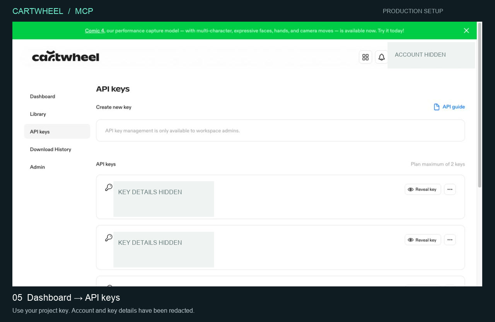

# Production setup walkthrough

[](media/production-setup.mp4)

**[Watch the recorded click-through](media/production-setup.mp4)**

This recording uses the actual production website. It shows the homepage, plan selection, signup form, creative-workflow choices, Blender destination, and the production API-key page. Account and key details are redacted.

The video is an edited walkthrough captured during real browser interactions. It previews signup and then uses an existing account to demonstrate API-key navigation. It does **not** claim to create a new account, start a subscription, or create a key. Password entry, email verification, and checkout are not recorded.

## Create your account

1. Visit [getcartwheel.com](https://getcartwheel.com).
2. Select **Free trial** and review the current plans. Choose a plan that explicitly includes API access. The recorded example opens **Individual Pro**.
3. On **Create account**, use your email address or Google account. Enter your name and complete the sign-in information.
4. Choose what you create, then select **Blender** under **Where will your motion end up?**
5. Complete the registration, email verification, terms, and any checkout presented by Cartwheel. Review the current plan and trial conditions before confirming a subscription.

Plan names, pricing, limits, and signup details may change. Use the current information on Cartwheel's website rather than the recording as a pricing reference.

## Get a project API key

Open the [production dashboard](https://app.getcartwheel.com/) and select **API keys** in the sidebar.



Use **Create new key** when available, or **Reveal key** for an existing key you are authorized to use. Copy the secret value. Your project ID, a key's display name, and the API Gateway key ID are not API credentials.

If the page says key management is only available to workspace admins, ask a workspace administrator to provision the key. Having an API-enabled plan does not necessarily give every workspace member permission to manage keys.

## Install and connect the MCP server

```sh
git clone https://github.com/Cartwhl/cartwheel-mcp.git
cd cartwheel-mcp
npm ci
```

For a client using JSON MCP configuration, configure:

```json
{
  "mcpServers": {
    "cartwheel": {
      "command": "node",
      "args": ["/absolute/path/to/cartwheel-mcp/src/index.mjs"],
      "env": {
        "CARTWHEEL_API_KEY": "YOUR_PRODUCTION_PROJECT_KEY"
      }
    }
  }
}
```

For Codex, use the TOML example in the [main setup instructions](../README.md#3-connect-your-assistant).

Keep your real key in the client's secret/environment settings. Do not put it in a public repository or recording.

Reconnect the client, then ask it to **list your Cartwheel characters**. That is a read-only connection check. Once it works, generate a motion, poll its batch status, and download the result.

## Render in Blender

The [Blender examples](../examples/blender/README.md) include the scene code and generated motion files used by the gallery. They show how motion data becomes a complete scene with art direction, cameras, lights, props, and a finished render.
