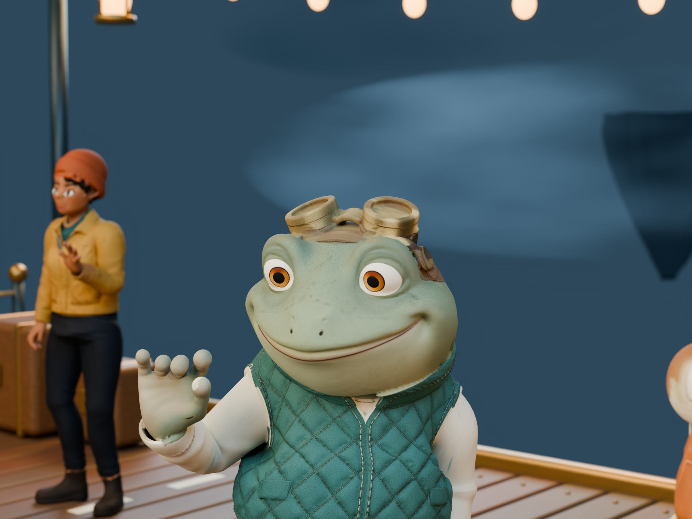
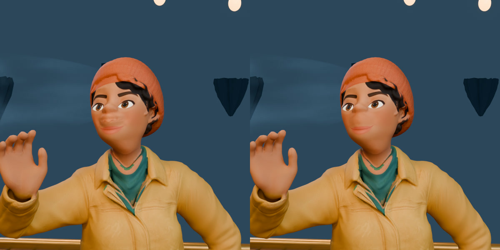

# Lantern Port

Three characters generated and auto-rigged with Cartwheel, animated with **Comic 4** acting and **swing-edit** walking, and rendered in a miniature skyport built in Blender. The eight-second film has four camera shots, a frog close-up, a moving linen airship, warm lanterns, textured cloth and an original bell-and-propeller soundscape.

[](../../docs/media/lantern-port.mp4)

[Watch the film](../../docs/media/lantern-port.mp4) · [Exact character prompts and provenance](provenance.json) · [Character creation workflow](../../src/workflows/characters.md)

## Reproduce the render

Clone this repository. This example and its approximately 50 MB of rigged character assets are GitHub assets; they are deliberately excluded from the npm MCP package. You need **Blender 5.2 or newer**, Python 3 for the optional audio, and FFmpeg for MP4 encoding. Rendering the included assets does not call Cartwheel or require an API key.

From the repository root, with your Blender executable available as `blender`:

```sh
blender --background --factory-startup --python-exit-code 1 \
  --python examples/lantern-port/scene.py -- \
  --output examples/lantern-port/output

blender --background examples/lantern-port/output/lantern-port.blend \
  --python-exit-code 1 --python examples/lantern-port/verify_contacts.py -- \
  --output examples/lantern-port/output/contact-audit.json

blender --background examples/lantern-port/output/lantern-port.blend \
  --python-exit-code 1 --python examples/lantern-port/render.py -- \
  --output examples/lantern-port/output/frames --start 1 --end 192 \
  --samples 256 --device CPU

python3 examples/lantern-port/audio.py \
  --output examples/lantern-port/output/ambience.wav

ffmpeg -framerate 24 -start_number 1 \
  -i examples/lantern-port/output/frames/%04d.png \
  -i examples/lantern-port/output/ambience.wav \
  -vf 'scale=out_color_matrix=bt709:out_range=tv,format=yuv444p12le,colorspace=all=bt709:ispace=bt709:irange=tv:iprimaries=bt709:itrc=srgb:format=yuv420p:dither=fsb' \
  -frames:v 192 -c:v libx264 -preset slow -crf 16 -pix_fmt yuv420p \
  -color_primaries bt709 -color_trc bt709 -colorspace bt709 -color_range tv \
  -c:a aac -b:a 192k -map_metadata -1 -movflags +faststart -shortest \
  examples/lantern-port/output/lantern-port.mp4
```

On macOS the Blender executable is usually `/Applications/Blender.app/Contents/MacOS/Blender`. Replace `--device CPU` with `--device METAL` for an available Apple GPU, or `OPTIX` / `CUDA` for a compatible NVIDIA configuration. The renderer reports the enabled devices. Use `--frames 19,65,128,180 --scale 60 --samples 32` for a small review before rendering the whole film. Use a new output directory after changing the scene: existing PNGs are retained to allow interrupted renders to resume.

The final film is **1920 × 1440 at 24 fps**. `render_settings.py` defines the shared final settings: up to 256 Cycles samples, a 0.005 adaptive noise threshold, at least 64 samples per pixel, high-quality OpenImageDenoise with albedo and normal guidance, and two volume bounces for the clouds. Frames are saved as 16-bit PNGs before the broadly compatible H.264/AAC encode. The encoder converts Blender's sRGB output to tagged Rec.709 with dithering, retaining the intended colors and smooth gradients. AgX color management, physical depth of field and restrained lantern bloom are part of the scene.

The builder creates a new scene and clears the current scene, so run it in a fresh Blender process as shown above. Open the saved `.blend` to inspect every camera, mesh, rig and animation channel. The build writes a `character-import-report.json` with the actual import scale and selected excerpt for each actor. `cast.json` controls the three placements and the exact capture excerpts.

## Create a different cast through the MCP

1. Read `cartwheel://workflows/characters` or request the `create_rigged_character` prompt. Call `prepare_character_generation` with one character description, then `submit_character_generation` with its returned job ID. Repeat for each distinct character. Preparation consumes credits; submit each prepared job once.
2. Poll `get_character` for the returned IDs until `uploadStatus` is `COMPLETE` and the model/config assets are present. `3D_CONVERT_COMPLETE` alone does not mean the rig is ready. For your own meshes, use `create_character_upload`, upload the model bytes, then `submit_character_upload` for auto-rigging instead.
3. Select a video you are authorized to process. Use `create_media_upload`, PUT the bytes with your MCP client's file tools, and call `generate_motion_from_video` with `comicModel: "comic4"`. Set the real performer count and preserve root motion. Follow `get_batch` and `list_batch_motions` until the capture and exports finish.
4. For each generated character, call `get_motion` with the completed capture's `motionID`, that character's `characterID`, the intended zero-based `bodyIndex`, and `downloadType: "gltf"`. Inspect the actual output timing. Download its `gltfURL` privately, put the selected GLB in this example's `assets` directory, and update `cast.json` with its filename, scale and excerpt.
5. Build a review, check shoulders, hands and feet through the complete clip, then render. The MCP generates and retrieves assets; Blender builds and renders the scene. You can invoke the scene builder directly or through a Blender MCP connection that you control.

For **swing-edit text-to-motion**, use `create_scene` with an accessible seed motion, `set_scene_character`, `edit_motion`, review the returned performance, `apply_motion_edit`, and `export_scene`. Start simple prompts with “A person doing …”. The seed provides the skeleton/template; text-only swing-edit generation omits constraints and key poses. Pip and Brass use this route with eight-second walking-and-settling prompts and the `open_loose` export hand preset. Exact prompts and seeds are in `provenance.json`. Read [all Motion Editor primitives](../../src/workflows/swing-edit.md).

## What is generated, captured and authored

- **Cast:** Captain Saffron, Pip the frog navigator, and Brass the robot dockhand are newly generated Cartwheel characters with the service's generated rigs. Exact prompts are in `provenance.json`.
- **Body motion:** Saffron's welcome uses the first eight seconds of performer 1 from an authorized 24-second, two-person Comic 4 capture. Pip and Brass use fresh swing-edit text-to-motion performances: they walk onto the dock, settle, and react. These are independently cast takes. Each character receives a constant scene placement, rotation and scale; horizontal travel and playback timing are retained. Gaussian contact IK adjusts the legs and pelvis height in Blender. Facial capture was disabled and the generated faces are static; swing-edit exports use the `open_loose` hand preset.
- **Blender:** the environment, airship, propellers, cloud volumes, lighting and four moving cameras are authored geometry and animation. The example uses volume-preserving Armature skinning, repairs malformed imported mesh normals and finishes the rigid boot soles. Saffron receives a localized surface and material cleanup around the generated face. Pip gets a stabilized portrait after the walk settles.
- **Sound:** `audio.py` synthesizes the original wind, propeller flutter and bell motif. It uses no recorded samples.

The source video, API credentials, signed asset URLs and raw service responses are private. They are unnecessary for rebuilding this film. The included generated characters and scene source are distributed under this repository's MIT license; the private reference video is not included or licensed here.

## Skinning and material review

The standard linear skinning collapsed the generated shoulder volumes. Enabling **Preserve Volume** (`ArmatureModifier.use_deform_preserve_volume`) improved the raised-arm poses and was retained for all three generated rigs. This is not a universal MHR setting: MHR with native body correctives expects its original linear skinning.

An independent shading issue made the skin and clothes appear fractured and metallic. Clearing the exported custom split normals and using smooth geometric normals restored the original color textures. Lowering the normal-map strength alone did not fix it. The bone hierarchy and rest transforms are retained. Saffron’s face welds duplicated seam vertices and applies a softly blended local smoothing pass to remove a malformed crease; corner UVs are retained.

The glTF importer also adds a hidden icosphere for bone display. `characters.py` excludes it when measuring character size and grounding.

`contacts.py` bakes two-bone IK on all three rigs. It detects low, slow foot contacts, measures the actual boot geometry and blends each plant toward a fixed sole anchor with **80 ms Gaussian transitions**. A 45 ms Gaussian pass on source ankle orientation prevents a fast toe-off and the releasing lock from adding an angular spike. Knee poles follow the original bend plane, leg lengths stay unchanged, and eased pelvis lowering maintains a bend reserve. Swing phases remain free. A smooth floor bound clears the deck while keeping established plants fixed.

The boots' lowest 15 mm receive rigid ankle weights, blending back to the original weights by 50 mm above the sole. This is footwear finishing for these three work-boot characters. It prevents sole deformation from defeating a fixed ankle; it should be adapted for bare feet or flexible footwear. The shared contact math also powers the earlier Blender examples.

`verify_contacts.py` independently measures the skinned sole surfaces throughout all 192 frames. It checks established-contact drift, floor clearance, foot turns, knee acceleration and leg lengths. Gaussian transitions permit settling near contact edges. Use both this audit and a moving preview before a final render; the detector infers contacts from motion rather than reading authored contact labels.

The face review below shows the original generated surface on the left and the localized cleanup on the right. This is a separate character-finishing review, before the final Comic 4 performances were attached.


